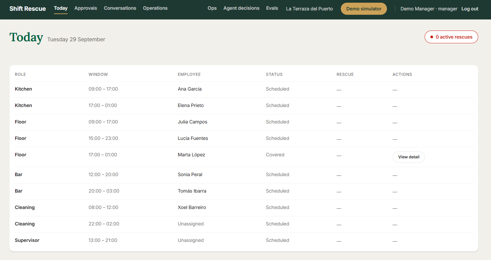
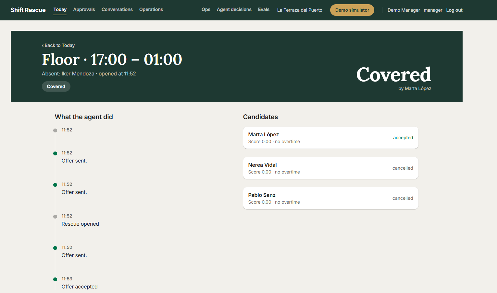
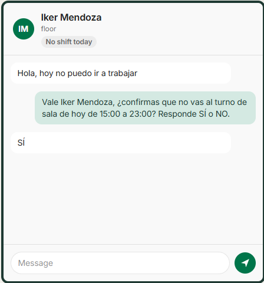
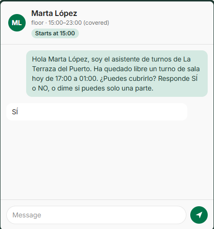

# Shift Rescue

**An AI agent that covers last-minute shift absences — so the manager doesn't have to.**

Shift Rescue automatically covers same-day absences for shift-based businesses
(hospitality, retail, staffing). It works over **WhatsApp** on top of the
existing HR system, and the manager always stays in control.

## The problem

When someone calls in sick, it is almost always **less than two hours before
their shift**, announced by WhatsApp. The manager — in the middle of opening,
receiving stock, setting up the floor — spends 30 to 60 minutes messaging and
calling around, without knowing who is available, who is close to their hour
limits, or who closed the night before. Uncovered shifts start short-handed:
slower service, stressed teams, worse reviews.

## The solution

A shift gets covered on its own — reliably, measurably and safely.

1. **An absence arrives** by WhatsApp. The agent confirms it with the absent
   employee in a short conversation.
2. **Deterministic rules decide who is eligible** — availability, hour limits,
   rest rules, overtime. The LLM only interprets language and drafts replies;
   it never decides who gets the shift.
3. **The agent does the legwork**: it offers the shift to eligible candidates
   over WhatsApp and tracks their answers.
4. **The manager approves** overtime, partial coverages and cancellations —
   and audits everything the agent did in one timeline.

## Screenshots

### Today view

The manager's home screen: today's shifts with role, window, employee and
rescue status, plus a live count of active rescues.



### Rescue case detail

Every rescue is a case with a full audit trail: what the agent did and when,
which candidates were offered the shift, their scores, and who accepted.



### Absence confirmation (WhatsApp)

The agent confirms the absence in the employee's own channel, in their
language, with explicit Sí/NO confirmation.



### Cover offer (WhatsApp)

The agent offers the open shift to an eligible candidate and handles the
answer — full shift, partial coverage, or no.



## Design principles

- **Deterministic core, LLM at the edges.** Business rules (eligibility,
  assignment, what needs approval) live in testable code. The LLM interprets
  language and drafts messages. The LLM proposes; the domain disposes.
- **The manager stays in control.** The agent does the legwork; humans approve
  anything sensitive. Every agent action is logged and auditable.
- **Built for production failure modes.** Duplicate messages, simultaneous
  replies, providers down, employees typing unexpected things — the system is
  designed to detect, recover and degrade gracefully.
- **Measurable.** Agent decisions and eval runs are first-class: everything is
  traced and reviewed, not vibes.

> Currently in development as a portfolio-grade MVP. See
> `docs/SHIFT_RESCUE_SPEC.md` for the full specification and
> [docs/system-design.md](docs/system-design.md) for the complete system
> design.

## Quick start

Prerequisites: [Docker](https://docs.docker.com/get-docker/) and
[uv](https://docs.astral.sh/uv/) (Python 3.12), [Node 24](https://nodejs.org)
and [pnpm 11](https://pnpm.io).

```bash
# 1. Boot the backend stack (postgres, redis, api, worker, beat)
make up            # = docker compose -f infra/docker-compose.yml up -d --build

# 2. Run migrations and seed the demo data
make seed

# 3. Check the API is alive
curl http://localhost:8000/health
# {"status":"ok","service":"shift-rescue-backend","environment":"local"}

# 4. Run the dashboard
make dev-frontend  # = cd frontend && pnpm dev  →  http://localhost:5173
```

Windows note: `make` is unavailable on plain Windows shells — open each
`Makefile` target and run the underlying command, or use WSL.

### Optional: observability stack

```bash
docker compose -f infra/docker-compose.yml --profile observability up -d
# Langfuse on http://localhost:3000 (wired with the evals-observability feature)
```

## Deployed demo

The demo runs on a single EC2 instance (Docker Compose + Caddy with automatic
TLS) with images from ECR, secrets in SSM Parameter Store and GitHub Actions
authenticated by OIDC. Observability exports to **Langfuse Cloud**, so no
Langfuse/ClickHouse containers live on the box (see
[ADR-003](docs/adr/ADR-003-deployment-aws.md) and `docs/runbook.md`).

| Component | Where |
|---|---|
| Dashboard | `https://<domain>/` (SSR-free SPA behind Caddy) |
| API + Twilio webhooks | `https://<domain>/api`, `https://<domain>/webhooks/twilio/*` |
| Workers | EC2 containers `worker` + `beat` |
| Data | PostgreSQL 16 + Redis on the instance (EBS volume) |
| Traces | Langfuse Cloud (OTLP with `LANGFUSE_*`) |

Deploy from GitHub: **Actions → Deploy demo → Run workflow** (or push to
`main`). Rollback: re-run the remote script with a previous image tag —
`./deploy/remote-deploy.sh <commit-sha>`.

Docs: [runbook](docs/runbook.md) · [eval report](docs/eval-report.md) ·
[demo script](docs/demo-script.md) · [Twilio sandbox setup](docs/twilio-sandbox-setup.md).

## Repository layout

```
backend/    FastAPI + Celery + SQLAlchemy (async) — the agent service
frontend/   React 19 + Vite — the manager dashboard (kanban + rescue detail)
infra/      docker-compose stack (postgres, redis, api, worker, beat, langfuse*)
docs/       specification, ADRs, assumptions
odd/tasks/  ODD feature documents (one per feature, mirrored in Engram)
```

## Development

| Command | What it does |
|---|---|
| `make test` | Backend pytest + frontend vitest |
| `make lint` | ruff + mypy (strict) + oxlint |
| `make dev-backend` | FastAPI with reload on :8000 |
| `make dev-frontend` | Vite dev server on :5173 |

Demo credentials (created by `make seed`): `manager@laterraza.demo`
(password auth lands with the manager-dashboard auth slice).

## Documentation

- [System design](docs/system-design.md) — the complete walkthrough: problem,
  domain, rules, agent, architecture, evaluation, operations, deployment
- [Product & engineering specification](docs/SHIFT_RESCUE_SPEC.md)
- [ADR-001: foundation stack](docs/adr/ADR-001-foundation-stack.md)
- [ADR-002: Strands without the autonomous loop](docs/adr/ADR-002-strands-without-autonomous-loop.md)
- [ADR-003: demo deployment on AWS](docs/adr/ADR-003-deployment-aws.md)
- [Evaluation report](docs/eval-report.md) · [Runbook](docs/runbook.md) ·
  [Demo script](docs/demo-script.md)
- [Twilio sandbox setup](docs/twilio-sandbox-setup.md) ·
  [Assumptions log](docs/assumptions.md)

## License

TBD before public release.
